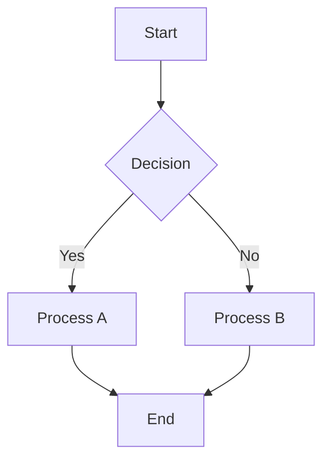
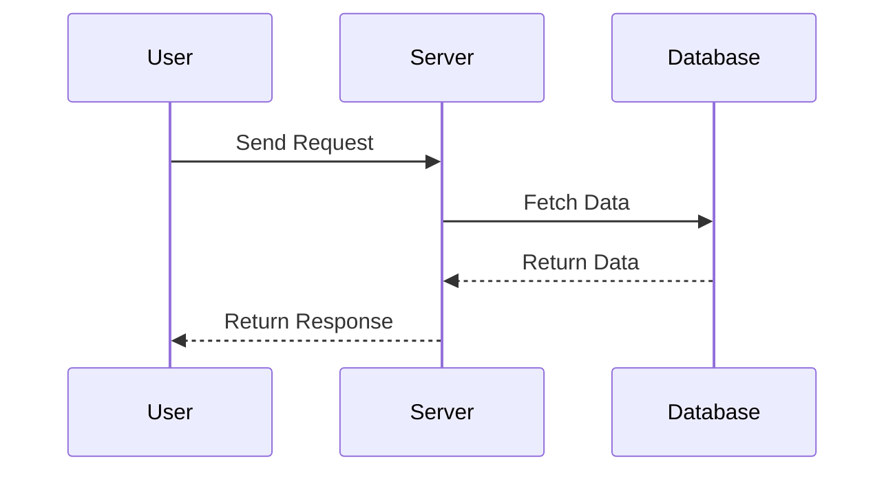
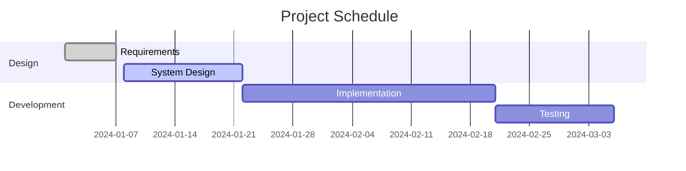

# Doc Style Rules

This document defines the style rules and guidelines specifically for documentation files in the `/doc/` directory using Docusaurus. These rules apply to internal technical documentation, development notes, and knowledge base articles.

## Docusaurus-Specific Features

### Admonitions (Callout Blocks)

Admonitions are special callout blocks that highlight important information. Use them to draw attention to key points, warnings, or helpful tips.

#### Available Types

##### Note - Basic Information

:::note
Use for general information or supplementary explanations. Ideal for additional context or standard notes.
:::

```markdown
:::note
Use for general information or supplementary explanations.
:::
```

##### Tip - Helpful Hints

:::tip
Share useful tips and best practices. Use for efficient methods or recommendations.
:::

```markdown
:::tip
Share useful tips and best practices.
:::
```

##### Info - Important Information

:::info
Provide important information or background knowledge. Use for facts or details that should be known.
:::

```markdown
:::info
Provide important information or background knowledge.
:::
```

##### Warning - Caution Required

:::warning
Alert users to items requiring caution. Use for potential issues or pitfalls.
:::

```markdown
:::warning
Alert users to items requiring caution.
:::
```

##### Danger - Critical Warning

:::danger
Warn about serious problems or dangers. Use for data loss, security risks, destructive operations, or anything that must be absolutely avoided.
:::

```markdown
:::danger
Warn about serious problems or dangers. Use for operations that must be absolutely avoided.
:::
```

#### Custom Titled Admonitions

You can set custom titles for each type:

:::note[Custom Note]
Example using a custom title.
:::

:::tip[Pro Tip]
Use when sharing advanced techniques.
:::

:::warning[Breaking Changes]
Warn about incompatibilities during version upgrades.
:::

```markdown
:::note[Custom Title]
Information block with custom title.
:::

:::tip[Pro Tip]
Advanced user advice.
:::
```

### Mermaid Diagrams

Docusaurus supports diagram creation with [Mermaid](https://mermaid.js.org/).

#### Flowchart



````markdown

````

#### Sequence Diagram



````markdown

````

#### Gantt Chart



## Documentation Structure

### File Naming Conventions

#### Basic Rules

- **Use lowercase and hyphens**: `image-processing-system.md`
- **No date prefixes**: Don't use dates even in the INBOX category
- **Clear and descriptive names**: Content should be inferrable from the filename

#### Category-Specific Naming Patterns

| Category | Pattern | Example |
|---------|---------|---------|
| INBOX | `{feature}-{aspect}.md` | `blurhash-loading-system.md` |
| Misc | `{topic}-rule.md` | `doc-style-rule.md` |
| Guides | `{action}-guide.md` | `setup-guide.md` |
| API | `{service}-api.md` | `algolia-api.md` |

### Frontmatter

Include appropriate frontmatter in all documentation files:

```markdown
---
title: Document Title
sidebar_position: 1
description: Brief description of this document
tags: [docusaurus, style-guide]
---
```

#### Required Fields

- `title`: Page title (displayed in sidebar and browser tab)
- `sidebar_position`: Display order in sidebar

#### Optional Fields

- `description`: Meta description for SEO
- `tags`: Classification tags for the document
- `slug`: Custom URL (defaults to filename)
- `draft`: Set to `true` for draft status (hidden in production)

### Category Configuration (_category_.json)

Define categories by placing `_category_.json` in each directory:

```json
{
  "label": "Category Name",
  "position": 2,
  "link": {
    "type": "generated-index",
    "description": "Category description"
  },
  "collapsible": true,
  "collapsed": false
}
```

## Content Guidelines

### Section Structure

#### Standard Document Structure

```markdown
# Document Title

Overview description (1-2 paragraphs)

## Background and Purpose

Why this document is necessary

## Main Content

### Subsection 1

Detailed content

### Subsection 2

Detailed content

## Implementation Examples

Concrete code examples

## Troubleshooting

Common problems and solutions

## Related Links

- [Related Document 1](./related-doc1.md)
- [Related Document 2](./related-doc2.md)

## Revision History

- 2024-12-14: Initial version created
- 2024-12-15: Added sections
```

### Internal Links

#### Using Relative Paths

```markdown
<!-- Same directory -->
[Related Document](./related-doc.md)

<!-- Parent directory -->
[Parent Document](../parent-doc.md)

<!-- Other categories -->
[INBOX Document](../inbox/some-doc.md)
```

:::warning[Important Limitation]
Links to files outside the `/doc/` directory will not work. Avoid links to project root files (like `../../src/`).
:::

### Code Blocks

#### Language Specification and Title

````markdown
```typescript title="src/utils/example.ts"
export function processData(input: string): string {
  return input.toUpperCase();
}
```
````

#### Show Line Numbers

````markdown
```javascript showLineNumbers
function example() {
  const line1 = "First line";
  const line2 = "Second line";
  return [line1, line2];
}
```
````

#### Highlight Specific Lines

````markdown
```typescript {2,4-6}
const config = {
  name: "example",  // This line is highlighted
  version: "1.0.0",
  features: [       // These lines
    "feature1",     // are also
    "feature2"      // highlighted
  ]
};
```
````

### Image Management

#### Image Placement

Place images in the `/doc/static/img/` directory:

```
doc/
  static/
    img/
      screenshots/
        feature-screenshot.png
      diagrams/
        architecture-diagram.svg
```

#### Image References

```markdown


<!-- With caption -->

*Figure 1: System Architecture Diagram*
```

## INBOX Documentation Best Practices

The INBOX category is a special area for rapid documentation during development.

### When to Use INBOX

:::tip[When to Use INBOX]
1. **Implementing complex features**: Record architecture and implementation details
2. **Recording bug fixes**: Document issues, investigation process, and solutions
3. **Discovering important patterns**: Record patterns to follow in the future
4. **Creating new systems**: Document how they work and how to use them
5. **Research findings**: Record investigation results that might be useful later
:::

### How to Write INBOX Documents

#### Record Immediately

```markdown
---
title: Blurhash Loading System Investigation
sidebar_position: 999  # Temporarily place at the end
---

# Blurhash Loading System Investigation

## Discovery Date: 2024-12-14

### Problem
Slow image loading

### Investigation
[Record investigation process in detail]

### Solution
[Implemented solution]

### TODO
- [ ] Conduct performance tests
- [ ] Verify in production environment
```

#### Organize Later

After initial documentation, when time permits:
1. Set appropriate `sidebar_position`
2. Organize sections
3. Add code examples
4. Add links to related documents

## Documentation Quality Checklist

Checklist for creating new documentation:

### Creation Checklist

- [ ] Appropriate frontmatter is set
- [ ] Filename follows naming conventions
- [ ] First paragraph contains overview
- [ ] Appropriate admonitions are used

### Content Checklist

- [ ] Code examples included (if applicable)
- [ ] Error cases documented
- [ ] Links to related documents included
- [ ] Revision history section included

### Technical Checklist

- [ ] Internal links work correctly
- [ ] Code blocks have language specified
- [ ] Mermaid diagrams render correctly
- [ ] Image paths are correct

## Deprecated Practices

### Things to Avoid

:::danger[Must Absolutely Avoid]
1. **Links to external directories**: Links like `../../src/` will not work
2. **Date prefixes**: Avoid naming like `2024-12-14-feature.md`
3. **Uppercase filenames**: Use `feature-doc.md` instead of `Feature-Doc.md`
4. **Deep nesting**: Avoid directory nesting deeper than 3 levels
:::

### Alternatives

| What to Avoid | Recommended Alternative |
|---------------|------------------------|
| Links to external files | Include content as code examples |
| Date prefixes | Include dates in frontmatter or revision history section |
| Long single documents | Split by related topics |
| External image references | Copy to `/static/img/` and reference |

## Docusaurus-Specific Features

### Tabs

For displaying multiple options (only available in MDX files):

````markdown
import Tabs from '@theme/Tabs';
import TabItem from '@theme/TabItem';

<Tabs>
  <TabItem value="npm" label="npm" default>

```bash
npm install package-name
```

  </TabItem>
  <TabItem value="yarn" label="Yarn">

```bash
yarn add package-name
```

  </TabItem>
</Tabs>
````

:::warning[Usage in MDX Files]
Tab components can only be used in files with `.mdx` extension. They cannot be used in regular `.md` files.
:::

### Collapsible Sections

```markdown
<details>
<summary>Show Detailed Information</summary>

Place detailed content here.
Suitable for long explanations or optional information.

</details>
```

### Versioned Documentation

:::info[Future Enhancement]
As the project grows, you can use Docusaurus's versioning features to manage documentation for different versions.
:::

## Revision History

- **2024-12-14**: Initial version created
  - Defined admonition usage
  - Added Mermaid diagram examples
  - Documented INBOX best practices
  - Established file naming conventions

---

:::note[About Contributions]
This style guide is continuously improved. Please update this document when new patterns or conventions are established.
:::